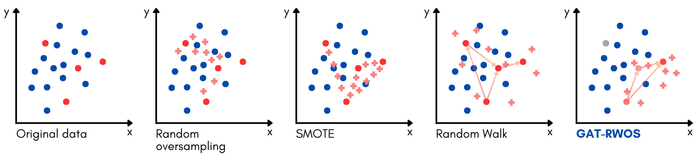
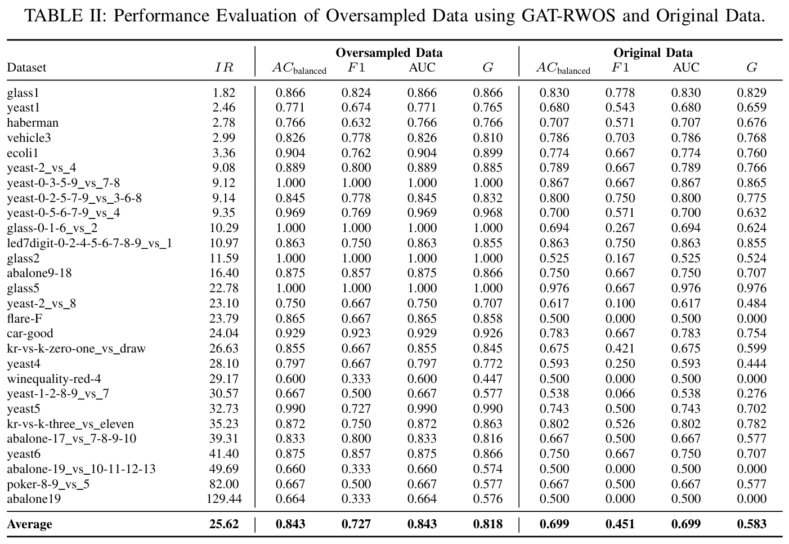

# GAT-RWOS: Graph Attention-Guided Random Walk Oversampling for Imbalanced Data Classification

[](https://opensource.org/licenses/MIT)
[](https://www.python.org/downloads/)

## Description

<div style="font-size: 1.1em; padding-bottom: 1em">
GAT-RWOS is a graph-based oversampling method that combines Graph Attention Networks (GATs) with random walk-based oversampling to address the class imbalance problem. By utilizing GAT's attention mechanism to guide random walks through <i>informative</i> neighborhoods of minority nodes, GAT-RWOS generates synthetic samples that expand class boundaries while preserving the original data distribution.
</div>

> **TL;DR:** We create samples around those instances deemed *important* by GAT.



## Installation

### Prerequisites
- Python >= 3.9 (Tested on 3.9-3.12)
- PyTorch (follow installation instructions at [pytorch.org](https://pytorch.org/get-started/locally/))

### Dependencies
- pandas
- numpy
- scikit-learn
- optuna
- tqdm
- pyyaml
- scipy
- xgboost
- pytorch_geometric

> **Note**: these dependencies will be installed automatically when you install this package

### Setup

```bash
# Clone the repository
git clone https://github.com/zahiriddin-rustamov/gat-rwos.git
cd gat-rwos

# Install in development mode
pip install -e .
```

## Usage

GAT-RWOS can be used in three ways:

1. Command-line interface:
```bash
gat_rwos --datasets yeast6 flare-F
```

2. Python module:
```bash
python -m gat_rwos.main --datasets yeast6
```

3. As a Python package:
```python
from gat_rwos import main
main.run(dataset="yeast6")
```

### Command Line Arguments
- `--datasets`: Names of datasets to process (without extension)
- `--tune`: Enable hyperparameter tuning. You can control the configurations in the config file
- `--random_state`: There is also random_state parameter in the config file. You can override it with this argument.
- `--config`: Path to configuration file (default: configs/config.yaml)

## Data Format

> You can use the datasets provided in the `data/` folder or use your own datasets. \
> If you decide to use your own datasets, please ensure that they meet the following:

The input data should be in CSV format with the following requirements:
- The target variable must be named 'class'
- Binary classification only
- No missing values
- Features can be either numerical or categorical

Example dataset structure:
```csv
feature1,feature2,feature3,class
0.1,0.5,0.2,0
0.2,0.3,0.1,1
...
```

## Project Structure
```
gat_rwos/
├── src/gat_rwos/       # Main package source code
├── configs/            # Configuration files
├── data/              # Dataset files (.csv format)
└── results/           # Generated results
```

The results folder will contain:
- `{dataset_name}/`
    - `{dataset_name}_results.csv`        # Results with oversampled data
    - `{dataset_name}_original_results.csv`# Results with original data
    - `{dataset_name}_balanced.csv`       # Generated balanced dataset
    - `{dataset_name}_original_vs_oversampled.png` # Visualization

## Configuration

GAT-RWOS uses a YAML configuration file to control all aspects of the pipeline. Here are the key configuration parameters:

<details>

<summary>Expand to view configuration parameters</summary>

### Data Processing
```yaml
data:
  scaler: "minmax"      # Data scaling method: minmax, standard, or none
  test_size: 0.1        # Proportion of test set
  val_size: 0.1         # Proportion of validation set
```

### Graph Construction
```yaml
graph:
  similarity_method: "euclidean"   # Distance metric: euclidean, cosine, manhattan
  similarity_threshold: 0.5        # Threshold for edge creation. Setting this higher will result in a sparser graph
```

### GAT Architecture
```yaml
hid: 32              # Hidden dimension size
in_head: 4           # Number of attention heads in input layer
out_head: 3          # Number of attention heads in output layer
dropout_rate: 0.3    # Dropout rate
num_hidden_layers: 3 # Number of hidden layers
```

### Attention Aggregation
```yaml
aggregation_method: "mean" # Aggregation method: mean, median, max, mul. This is how we combine the attention weights into an attention matrix
attention_threshold: 0.5  # This controls the "importance" of the connections. Setting this higher will only keep stronger connections (i.e., pairs of nodes with higher attention weights).
```

### Random Walk Parameters
```yaml
num_steps: 10        # Length of random walks
p: 0.5              # Return parameter (controls likelihood of returning to previous node)
q: 2.0              # In-out parameter (controls search behavior)
```

### Interpolation Settings
```yaml
num_interpolations: 15  # Number of interpolations per path
min_alpha: 0.1         # Minimum interpolation weight
max_alpha: 0.9         # Maximum interpolation weight
variability: 0.9      # Variability of interpolation weights
```

</details>

## Hyperparameter Tuning

GAT-RWOS uses [Optuna](https://github.com/optuna/optuna) for hyperparameter optimization. The tuning process occurs in three **hierarchical** stages, (number of trials for each can be controlled in the config file):

1. **Main Model Parameters (`n_trials_main`)**: Optimizes GAT architecture parameters (hidden dimensions, number of heads, dropout rate)
2. **Attention Parameters (`n_trials_attention`)**: Tunes attention threshold and aggregation method
3. **Interpolation Parameters (`n_trials_interpolation`)**: Optimizes random walk and interpolation settings

Total number of trials = `n_trials_main` * `n_trials_attention` * `n_trials_interpolation`. Setting these to higher values will result in a more thorough search *but* at the cost of increased computation time.

The tuning ranges can be configured in the config file under the `tuning.optuna.ranges` section:

```yaml
tuning:
  optuna:
    ranges:
      similarity_methods: ["cosine", "euclidean", "manhattan"]
      hid: 
        min: 4
        max: 64
      dropout_rate:
        min: 0.0
        max: 0.7
      # ... other parameters
```

## Results



## Common Issues and Solutions

1. **CUDA Out of Memory**
   - Try reducing the `hid` parameter in the config file
   - Decrease `num_hidden_layers`

2. **Graph Construction Failure**
   - Try a different `similarity_method` (e.g., switch from 'euclidean' to 'cosine')
   - Lower the `similarity_threshold` to create more connections
   - Ensure your data is properly scaled (*this makes a lot of difference*)

3. **Poor Performance**
   - Increase the number of trials in tuning parameters (`n_trials_main`, `n_trials_attention`, `n_trials_interpolation`)
   - Try different `aggregation_method` method and play with the `attention_threshold`.
   - Adjust the random walk parameters (`num_steps`, `p`, `q`)
  
4. **Pandas Error on Python 3.12**
   - `RecursionError: maximum recursion depth exceeded`: This can be solved my upgrading both `pandas` and `numpy` to the latest versions.

## Citation
<!-- 
If you find this work helpful, please consider citing our paper:
```
@article{rustamov2024gatrwos,
    title={GAT-RWOS: Graph Attention-Guided Random Walk Oversampling for Imbalanced Data Classification}, 
    author={Rustamov, Zahiriddin and Lakas, Abderrahmane and Zaki, Nazar},
    year={2024},
    eprint={XXXX.XXXXX},
    archivePrefix={arXiv},
    primaryClass={cs.LG}
}
``` -->